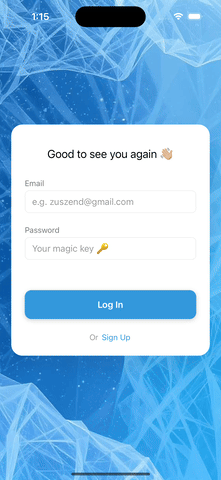

## About
A simple app demonstrating a credit transfer module with biometric authentication.
<br/>
> ⚠️ **Note:** The `.env` file is not included in this repo. Please email me to get a copy.
<br/>

## APK for easy demo
No setup needed, just download here:
https://github.com/qarnayn-dev/credit_management_app/releases/download/v0.0.1-alpha/credit_management_app_v0.0.1.apk

## Sample Demo
A quick preview of the Credit Management App in action:
<br/>

A demo of Login and signup feature!  


<br/>

Transfer Credit with biometric authentication!  


# Getting Started (require technical knowledge)
> **Note**: Make sure you have completed the [Set Up Your Environment](https://reactnative.dev/docs/set-up-your-environment) guide before proceeding.

## Step 1: Start Metro

First, you will need to run **Metro**, the JavaScript build tool for React Native.

To start the Metro dev server, run the following command from the root of your React Native project:

```sh
# Using npm
npm start

# OR using Yarn
yarn start
```

## Step 2: Build and run your app

With Metro running, open a new terminal window/pane from the root of your React Native project, and use one of the following commands to build and run your Android or iOS app:

### Android

```sh
# Using npm
npm run android

# Using npx (if script not set up)
npx react-native run-android

# OR using Yarn
yarn android
```

### iOS

For iOS, remember to install CocoaPods dependencies (this only needs to be run on first clone or after updating native deps).

The first time you create a new project, run the `pod install` command inside of ios directory or run Ruby bundler to install CocoaPods itself:

```sh
cd ios
pod install
```

```sh
# if using bundle
bundle install
```

Then, and every time you update your native dependencies, run:

```sh
bundle exec pod install
```

For more information, please visit [CocoaPods Getting Started guide](https://guides.cocoapods.org/using/getting-started.html).

```sh
# Using npm
npm run ios

# Using npx (if script not set up)
npx react-native run-ios

# OR using Yarn
yarn ios
```

If everything is set up correctly, you should see your new app running in the Android Emulator, iOS Simulator, or your connected device.

This is one way to run your app — you can also build it directly from Android Studio or Xcode.